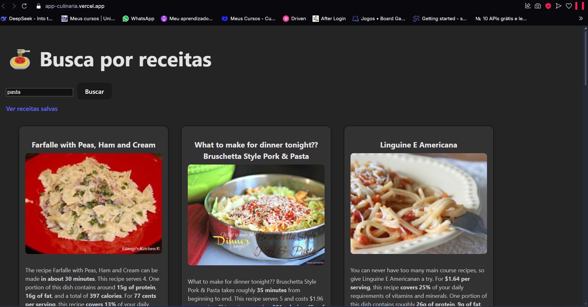

# 📝 Recipe Finder - Buscador de Receitas

## 📌 Sobre o Projeto

O **Recipe Finder** é uma aplicação web que permite aos usuários buscar receitas culinárias utilizando a API Spoonacular. Os usuários podem pesquisar por diferentes tipos de receitas, visualizar detalhes e salvar suas favoritas para acesso posterior.

Principais funcionalidades:
- 🔍 Busca de receitas por termo (ex: "pasta", "cake")
- 💾 Salvar receitas favoritas no localStorage do navegador
- 📌 Visualizar todas as receitas salvas em uma página dedicada
- 🚫 Página 404 personalizada para rotas inexistentes

## 🛠 Tecnologias Utilizadas

- **Frontend:**
  - 
  - 
  - 
  - 

- **API:**
  - 

- **Ferramentas:**
  - 
  - 

## 🖼 Screenshots

### Página Principal
  
*Interface de busca com grid de receitas*


## 🚀 Como Executar o Projeto

1. **Pré-requisitos:**
   - Node.js (v16 ou superior)
   - Chave de API do Spoonacular (configurada no arquivo `.env`)

2. **Instalação:**
   ```bash
   git clone https://github.com/seu-usuario/recipe-finder.git
   cd recipe-finder
   npm install
   ```

3. **Configuração:**
   Crie um arquivo `.env` na raiz do projeto com:
   ```env
   VITE_SPOONACULAR_API_KEY=sua_chave_aqui
   ```

4. **Execução:**
   ```bash
   npm run dev
   ```

5. **Acesse:**
   Abra seu navegador em [http://localhost:5173](http://localhost:5173)
   
   Link deploy: https://app-culinaria.vercel.app

## 📝 Licença

Este projeto está licenciado sob a licença MIT - veja o arquivo [LICENSE](LICENSE) para detalhes.
